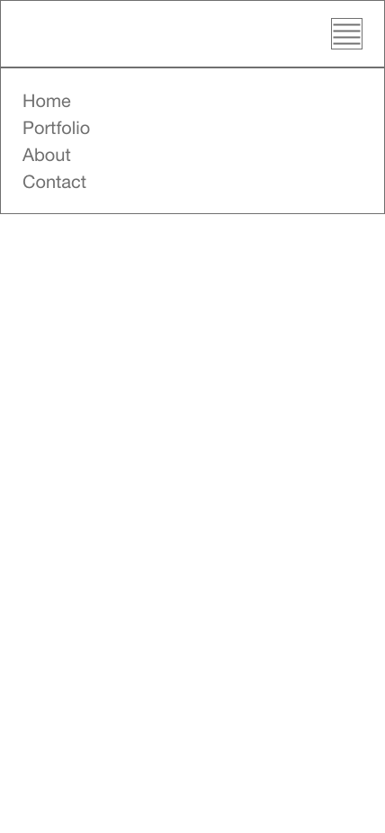
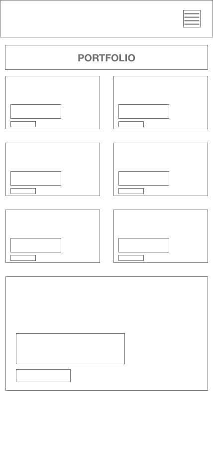
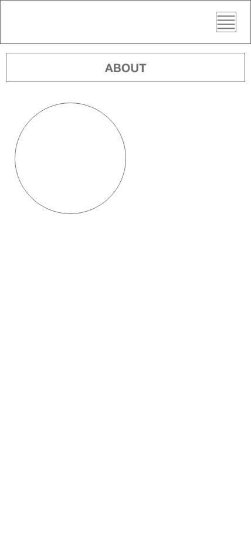
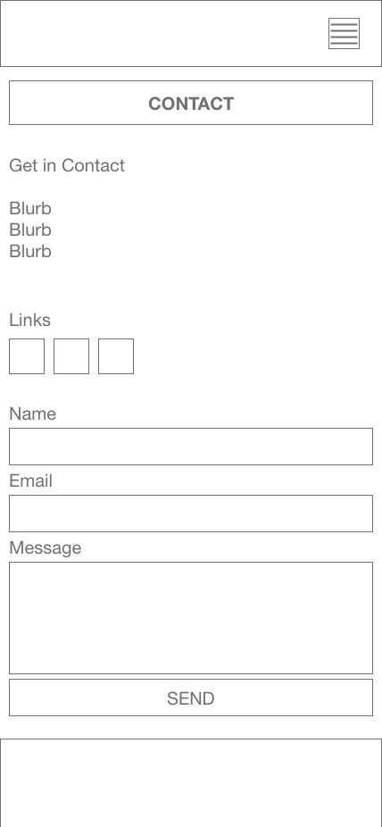

# 02-HW-ProfessionalPortfolio

## Description

The beginnings of my portfolio showcasing development work, with scope for more work to be added in.

## What We Did
The site was wireframed and designed with a mobile-first approach.
We consolidated the CSS styling by combining duplicate/redundant styling declarations.

## Deployment
The portfolio has been deployed at:
[Professional Portfolio GitHub](https://mrsamlaw.github.io/02-HW-ProfessionalPortfolio/)

## Screenshot

## Wireframes

